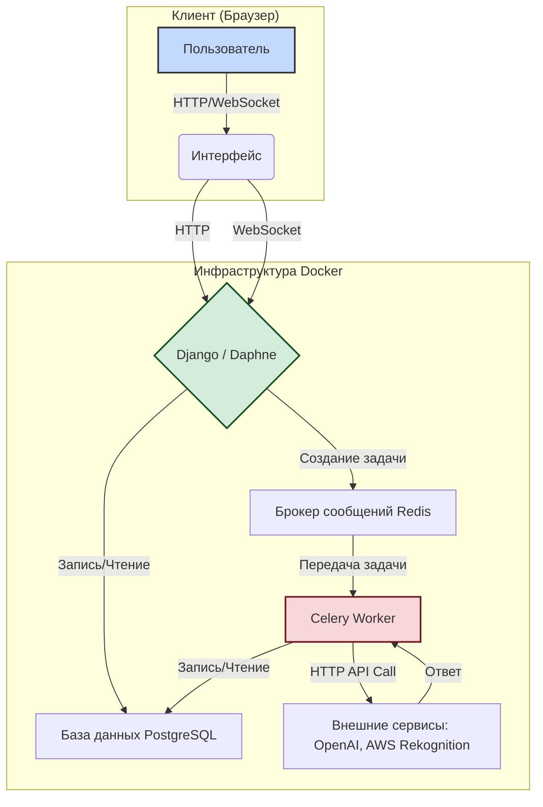

# ⚜️ PsyAI-Chat: Продвинутый MVP Платформы для Психологической Поддержки

[](https://www.python.org/downloads/)
[](https://www.djangoproject.com/)
[](https://pytest.org/)
[](https://github.com/psf/black)
[](https://github.com/astral-sh/ruff)

**PsyAI-Chat** — это продвинутый прототип веб-платформы для оказания психологической поддержки. Проект эволюционировал от простого синхронного MVP до надежной асинхронной системы, способной обрабатывать тяжелые задачи в фоновом режиме, интегрироваться с внешними платежными системами и API для анализа изображений.

## ✨ Ключевые Возможности

*   **Асинхронный чат с ИИ:** Взаимодействие с GPT происходит в фоновом режиме с помощью `Celery` и `Redis`, не блокируя интерфейс пользователя. Клиент получает статус "ИИ печатает...", что значительно улучшает UX.
*   **Анализ эмоций по фото:** Интеграция с `Amazon Rekognition` для анализа эмоций на загруженных пользователем фотографиях. Логика полностью покрыта тестами с использованием моков (`unittest.mock`), что позволяет вести разработку без реальных ключей AWS.
*   **Интеграция с платежной системой:** Реализована полноценная интеграция с `ЮKassa`, включая создание платежей и обработку входящих вебхуков для подтверждения оплаты.
*   **История чатов:** Пользователи могут просматривать историю всех своих прошлых сессий.
*   **Восстановление пароля:** Реализован стандартный для индустрии механизм сброса пароля через email с использованием `django-anymail` и `SendGrid`.
*   **Полная контейнеризация:** Весь проект и его зависимости (PostgreSQL, Redis) управляются через `Docker` и `Docker Compose` для легкого запуска и разработки.

## 🏛️ Архитектура Проекта

Проект построен на основе архитектуры **"Монолит+"**. Ядро представляет собой классическое монолитное приложение на Django, которое отвечает за обработку HTTP-запросов, аутентификацию и рендеринг страниц.

Все "тяжелые" или длительные операции (запросы к GPT, анализ изображений) вынесены из основного потока и выполняются асинхронно с помощью **Celery Workers**. Это обеспечивает отзывчивость интерфейса и масштабируемость системы.



## 🛠️ Технологический Стек

| Категория             | Технология                                                              |
| --------------------- | ----------------------------------------------------------------------- |
| **Бэкенд**            | Python 3.11+, Django, Django Channels, Daphne                           |
| **База данных**       | PostgreSQL                                                              |
| **Кэширование / Брокер** | Redis                                                                   |
| **Асинхронные задачи**  | Celery, Flower (для мониторинга)                                        |
| **Внешние API**       | OpenAI, Amazon Rekognition (boto3), ЮKassa, SendGrid (django-anymail)   |
| **Фронтенд**          | Django Templates, JavaScript (для WebSocket и Polling)                  |
| **Тестирование**      | Pytest, pytest-django, unittest.mock                                    |
| **DevOps**            | Docker, Docker Compose, Poetry, Ruff, Black, pre-commit                 |

## ⚙️ Установка и Запуск

### 1. Предварительные требования
*   [Git](https://git-scm.com/)
*   [Docker](https://www.docker.com/products/docker-desktop/) и Docker Compose

### 2. Клонирование репозитория
```bash
git clone <your-repository-url>
cd psyai-chat
```

### 3. Настройка переменных окружения
Создайте файл `.env` в корне проекта, скопировав содержимое из `.env.example`.

```bash
cp .env.example .env
```
Откройте файл `.env` и **обязательно** заполните переменные.

| Переменная              | Описание                                                                  | Обязательно для запуска? |
| ----------------------- | ------------------------------------------------------------------------- | :----------------------: |
| `DJANGO_SECRET_KEY`     | Уникальный секретный ключ Django. **Сгенерируйте новый!**                  |           **Да**           |
| `DJANGO_DEBUG`          | Режим отладки (`True` для разработки).                                    |           **Да**           |
| `DATABASE_URL`          | URL для подключения к PostgreSQL (уже настроен для Docker).               |           **Да**           |
| `CELERY_BROKER_URL`     | URL для подключения к Redis (уже настроен для Docker).                    |           **Да**           |
| `GPT_API_KEY`           | Ваш ключ от OpenAI. Если не указан, сервис GPT будет работать в mock-режиме. |            Нет             |
| `YOOKASSA_SHOP_ID`      | ID вашего магазина в ЮKassa.                                               |            Нет             |
| `YOOKASSA_SECRET_KEY`   | Секретный ключ вашего магазина в ЮKassa.                                  |            Нет             |
| `SENDGRID_API_KEY`      | Ваш ключ от SendGrid для отправки email.                                  |            Нет             |
| `DEFAULT_FROM_EMAIL`    | Email-адрес отправителя по умолчанию.                                     |            Нет             |
| `AWS_ACCESS_KEY_ID`     | Ключ доступа к AWS.                                                       |            Нет             |
| `AWS_SECRET_ACCESS_KEY` | Секретный ключ доступа к AWS.                                             |            Нет             |
| `AWS_REGION`            | Регион AWS, где будет использоваться Rekognition (например, `eu-central-1`). |            Нет             |

### 4. Запуск проекта
```bash
docker-compose up --build -d
```Эта команда соберет все образы и запустит контейнеры в фоновом режиме. Приложение будет доступно по адресу **`http://localhost:9000`**.

### 5. Создание суперпользователя
Чтобы получить доступ к админ-панели (`/admin`), выполните в новом терминале:
```bash
docker-compose exec app python manage.py createsuperuser
```

## ✅ Запуск Тестов
Для запуска полного набора тестов выполните команду:
```bash
docker-compose exec app pytest
```

## 📂 Структура Проекта
*   `/analysis/`: Логика анализа изображений (модели, сервисы, задачи Celery, тесты).
*   `/chat/`: Все, что связано с чатом (WebSocket-consumer, модели сессий и сообщений, задачи Celery).
*   `/config/`: Глобальные настройки проекта Django, Celery, ASGI, URL-маршруты.
*   `/core/`: Базовое приложение для общих элементов (если потребуется).
*   `/mocks/`: Приложение для старых или временных заглушек.
*   `/payments/`: Логика интеграции с платежной системой ЮKassa.
*   `/templates/`: Глобальная папка с HTML-шаблонами.
*   `/tests/`: Папка с тестами, зеркально повторяющая структуру приложений.
*   `/users/`: Управление пользователями, аутентификация, профиль.

## 🚀 Дальнейшее Развитие
*   **Вывод из mock-режима:** Заполнить реальный `GPT_API_KEY` и убрать заглушку из `gpt_service.py`.
*   **Развертывание:** Адаптировать `Dockerfile.prod` и развернуть проект на хостинге (например, Render, Railway).
*   **Расширение функционала:** Добавить новые типы анализа, улучшить интерфейс, внедрить систему уведомлений.
